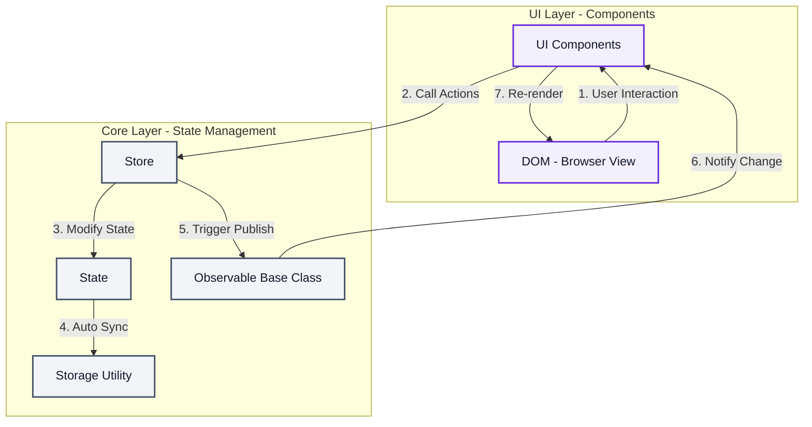

# 시스템 아키텍처 및 데이터 흐름도 (System Architecture & Data Flow)

이 문서는 TaskFlow 웹 애플리케이션의 내부 구조와 컴포넌트 간 단방향 데이터 흐름(Unidirectional Data Flow)을 시각화하여 설명합니다.

---

## 1. 데이터 흐름 다이어그램 (Mermaid)

---

## 2. 레이어별 주요 역할 정의

### 1) UI Layer (컴포넌트 레이어)
- **역할**: 브라우저 화면(DOM)을 드로잉하고 사용자 이벤트를 바인딩합니다.
- **주요 모듈**:
  - `DateHeader.js`: 일간 날짜 정보 표시 및 이전/다음 날짜 변경 요청
  - `WeeklyView.js`: 이번 주 7일 캘린더 표시, 할 일 개수 배지 렌더링, 특정 날짜 이동 요청
  - `TodoInput.js`: 할 일 문자열 입력 폼 제공, 빈 값 입력 시 인라인 예외 에러 표시
  - `TodoList.js`: 상태 필터에 따른 Todo 리스트 출력 및 할 일 CRUD(수정/삭제/토글) 제어
  - `FilterTabs.js`: 상태 필터 탭 클릭 처리
- **작동 원리**: 
  - 컴포넌트가 초기화될 때 `store.subscribe(this.render.bind(this))`를 호출하여 상태 관찰 대상으로 자신을 등록합니다.
  - 사용자 동작 발생 시 직접 상태를 바꾸지 않고, 오직 `Store` 인스턴스의 액션(Action) 함수만 호출합니다.

### 2) Core Layer (상태 관리 코어 레이어)
- **역할**: 전역 상태 보존, 이벤트 전파(Pub/Sub), 로컬 저장소 동기화의 핵심 기능을 담당합니다.
- **주요 모듈**:
  - **`observable.js` (Event Bus)**:
    - 전형적인 관찰자 패턴 부모 클래스입니다.
    - 상태 변경 시 이벤트를 발행(`publish`)하여 연결된 모든 컴포넌트들이 스스로 리렌더링하도록 돕습니다.
  - **`storage.js` (Persistence)**:
    - 로컬 스토리지 데이터 직렬화(`JSON.stringify`) 및 예외 처리(`try-catch`)를 전용 처리하는 파일입니다.
  - **`store.js` (State & Actions)**:
    - `Observable`을 상속하여 상태 관리 코어를 담당합니다.
    - 상태를 실시간 제어하는 **Action 레이어**와 특정 조건으로 가공해서 제공하는 **Getter 레이어**를 내포합니다.
    - 상태가 변경되면 자동으로 `storage.save()`를 수행한 뒤 `publish()`를 발행하여 단방향 흐름을 유지합니다.

---

## 3. 파일(모듈)별 메서드 기능 명세서

각 Javascript 파일별로 나누어 개별 함수 및 메서드들의 책임과 인터페이스를 표로 상세히 정의합니다.

### 1) app.js
*애플리케이션의 최초 구동 및 전역 객체 바인딩을 전담하는 진입 스크립트입니다.*

| 함수/이벤트명 (Method) | 매개변수 (Arguments) | 반환값 (Returns) | 상세 역할 설명 (Description) |
| :--- | :--- | :--- | :--- |
| `DOMContentLoaded` 이벤트 | - | - | 브라우저 DOM 로드가 끝난 후 앱을 부트스트랩하며 콘솔 모니터링 출력 및 `window.store` 바인딩 처리 |

---

### 2) js/core/observable.js (`Observable` 클래스)
*관찰자(Pub/Sub) 패턴을 구현하여 상태 변경 사항 전파를 담당하는 공통 부모 클래스입니다.*

| 메서드명 (Method) | 매개변수 (Arguments) | 반환값 (Returns) | 상세 역할 설명 (Description) |
| :--- | :--- | :--- | :--- |
| `constructor()` | - | - | 이벤트 감시 컴포넌트들의 콜백을 누적 보관할 `subscribers` 비어있는 배열 인스턴스 초기화 |
| `subscribe(callback)` | `callback` (Function) | - | 상태 변화 발생 시 스스로 화면을 다시 그리도록(Render) 컴포넌트의 렌더링 콜백 함수 등록 |
| `publish(state)` | `state` (Object) | - | 구독 목록 내 등록된 모든 리렌더링 콜백 함수들을 순회 실행하여 최신 상태 객체를 전역 배포 |

---

### 3) js/core/storage.js (`storage` 객체)
*LocalStorage 디스크 입출력을 격리하고 데이터 직렬화 예외 처리를 책임지는 네임스페이스 모듈입니다.*

| 메서드명 (Method) | 매개변수 (Arguments) | 반환값 (Returns) | 상세 역할 및 예외 처리 설명 (Description) |
| :--- | :--- | :--- | :--- |
| `save(data)` | `data` (Object) | - | 맵 형태의 할 일 데이터를 JSON 문자열로 변환하여 LocalStorage에 안전 저장 (접근 차단 오류 대비 try-catch) |
| `load()` | - | Object | 로컬스토리지 데이터를 JSON 디코딩 복구해 로드 (데이터 부재 또는 파싱 실패 시 `{}` 빈 객체 완충 반환) |

---

### 4) js/core/store.js (`Store` 클래스 - extends Observable)
*`Observable`을 상속받아 중앙 상태 트리(`state`)를 제어하는 핵심 전역 비즈니스 스토어 클래스입니다.*

| 메서드명 (Method) | 매개변수 (Arguments) | 반환값 (Returns) | 상세 역할 및 비즈니스 코드 설명 (Description) |
| :--- | :--- | :--- | :--- |
| `constructor()` | - | - | 부모 옵저버 인스턴스를 초기화하고, `storage.load()` 결과를 토대로 전역 `state` 객체 빌드 |
| `addTodo(text)` | `text` (String) | - | 입력 문자열 검증 후, 현재 날짜에 고유 타임스탬프 ID를 지닌 새 할 일 객체를 추가하고 `commitChanges()` 실행 |
| `toggleTodoStatus(todoId)` | `todoId` (Number) | - | 대상 ID의 할 일 `completed` 여부를 참/거짓으로 토글(반전) 적용하고 `commitChanges()` 실행 |
| `updateTodoText(todoId, newText)` | `todoId` (Number),   `newText` (String) | - | 수정 문자열 검증 후, 대상 ID 항목의 텍스트 내용을 변경 적용하고 `commitChanges()` 실행 |
| `deleteTodo(todoId)` | `todoId` (Number) | - | 대상 ID 항목을 삭제하며, 텅 빈 날짜는 메모리 관리를 위해 키를 영구 제거하고 `commitChanges()` 실행 |
| `setSelectedDate(dateString)` | `dateString` (String) | - | 활성화된 일간 기준 날짜를 변경하고 UI 재출력 알림 전송 (스토리지 미기록 즉시 전파) |
| `setFilter(filter)` | `filter` (String) | - | All/Active/Completed 조회 필터 기준을 갱신하고 UI 재렌더링 이벤트를 브로드캐스트 |
| `commitChanges()` | - | - | 로컬 저장소 세이브(`storage.save`)와 이벤트 알림 전송(`publish`) 로직을 일괄 결합 수행하는 내부 메서드 |
| `getFilteredTodos()` | - | Array | 현재 활성 `selectedDate`의 할 일 중 `activeFilter` 상태 조건에 합치하는 항목 배열만 걸러내어 반환 |
| `getTodoCountInfo(dateString)` | `dateString` (String) | Object | 특정 날짜에 귀속된 할 일들의 통계 수치(총개수, 진행 중 개수, 완료 개수)를 계산하여 리턴 |
| `getTodayDateString()` | - | String | 시스템 서버 시차 편차를 보정하고 브라우저 기기 기준의 로컬 오늘 날짜 포맷(YYYY-MM-DD)을 안정적 획득 |

---

## 5. 단방향 데이터 흐름의 이점
1. **예측 가능한 상태 변화**: 상태는 오직 `Store`의 Action 함수를 통해서만 수정되므로 추적이 매우 용이합니다.
2. **동기화 자동화**: UI 컴포넌트는 자신이 직접 데이터를 수정하고 다시 그리느라 신경 쓰지 않고, Store가 바뀌었다는 신호를 주면 그때 상태를 읽어 단순 렌더링만 수행하므로 동기화 실수가 발생하지 않습니다.
3. **독립성 향상**: 각 컴포넌트(`TodoList.js`, `WeeklyView.js` 등)는 서로의 존재를 알 필요가 없으며, 오직 중앙 `Store`하고만 통신하므로 컴포넌트 간 결합도가 0에 수렴합니다.
